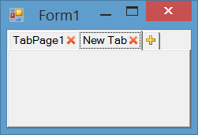

# Tab Control with Close Button and Add Button
You can show close button on tab pages of a tab control to let the users close a tab. Also you can show an add button for tab control to let the users add a new tab.

To do so, We will use an owner draw tab to show close icons on each tab an add icon on the last tab. We use `DrawItem` to draw close and add icons, `MouseDown` to handle click on close and add buttons, `Selecting` to prevent selecting of the last tab and `HandleCreated` to adjust tab width.

You need to set a suitable padding and set `DrawMode` to `OwnerDrawFixed` and also set the text of last tab page to empty string. We will use that tab as add button. 

**Handle click on close button and add button**

You can handle `MouseDown` or `MouseClick` event and check if the last tab rectangle contains the mouse clicked point, then insert a tab before the last tab. Otherwose check if one of close buttons contains clicked location, then close the tab which its close button was clicked

**Prevent selectin last tab**

To prevent selection the last tab, you can handle `Selecting` event of control and check if the selecting tab is the last tab, cancel the event.

**Draw Close Button and Add Button**

To draw close button and add button, you can handle `DrawItem` event. 

**Adjust Tab width**

Set the last tab text to empty string. Then to adjust tab width and let the last tab have smaller width, you can hanlde `HandleCreated` event and send a [`TCM_SETMINTABWIDTH `](https://msdn.microsoft.com/en-us/library/windows/desktop/bb760637(v=vs.85).aspx) to the control and specify the minimum size allowed for the tab width

**Enhancements**

You can enhance the implementation by using `VisualStyleRenderer` and also supporting different tab orientation and also adding rtl support.